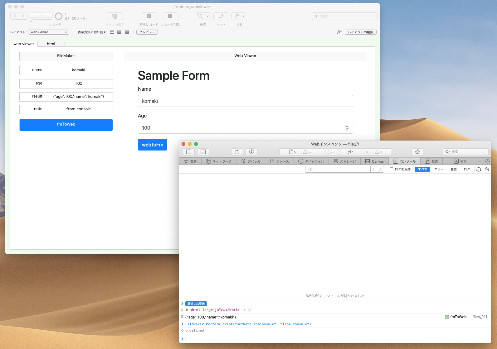
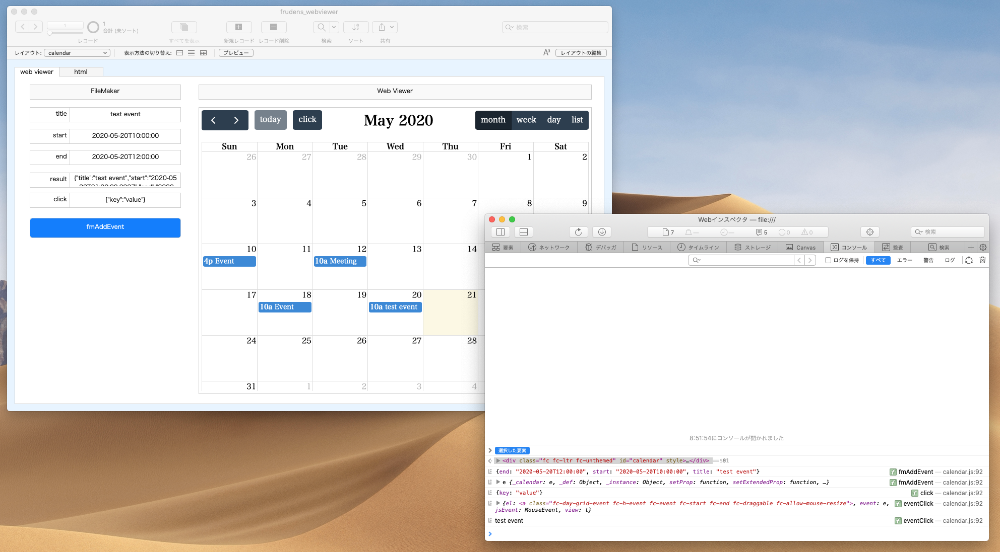

# filemaker-webviewer-javascript

## Web Viewer



```html
data:text/html,
<!DOCTYPE html>
<html>
  <head>
    <!-- Required meta tags -->
    <meta charset="utf-8" />
    <meta
      name="viewport"
      content="width=device-width, initial-scale=1, shrink-to-fit=no"
    />

    <!-- Bootstrap CSS -->
    <link
      rel="stylesheet"
      href="https://stackpath.bootstrapcdn.com/bootstrap/4.3.1/css/bootstrap.min.css"
      integrity="sha384-ggOyR0iXCbMQv3Xipma34MD+dH/1fQ784/j6cY/iJTQUOhcWr7x9JvoRxT2MZw1T"
      crossorigin="anonymous"
    />

    <title>Hello, world!</title>
  </head>
  <body>
    <div class="container">
      <div class="row">
        <div class="col">
          <h1>Sample Form</h1>
          <form>
            <div class="form-group">
              <label for="name">Name</label>
              <input
                type="text"
                class="form-control"
                id="name"
                placeholder="Enter Namel"
              />
            </div>
            <div class="form-group">
              <label for="age">Age</label>
              <input
                type="number"
                class="form-control"
                id="age"
                placeholder="Age"
              />
            </div>
            <button class="btn btn-primary" onclick="webToFm()">webToFm</button>
          </form>
        </div>
      </div>
    </div>

    <!-- Optional JavaScript -->
    <!-- jQuery first, then Popper.js, then Bootstrap JS -->
    <script
      src="https://code.jquery.com/jquery-3.3.1.slim.min.js"
      integrity="sha384-q8i/X+965DzO0rT7abK41JStQIAqVgRVzpbzo5smXKp4YfRvH+8abtTE1Pi6jizo"
      crossorigin="anonymous"
    ></script>
    <script
      src="https://cdnjs.cloudflare.com/ajax/libs/popper.js/1.14.7/umd/popper.min.js"
      integrity="sha384-UO2eT0CpHqdSJQ6hJty5KVphtPhzWj9WO1clHTMGa3JDZwrnQq4sF86dIHNDz0W1"
      crossorigin="anonymous"
    ></script>
    <script
      src="https://stackpath.bootstrapcdn.com/bootstrap/4.3.1/js/bootstrap.min.js"
      integrity="sha384-JjSmVgyd0p3pXB1rRibZUAYoIIy6OrQ6VrjIEaFf/nJGzIxFDsf4x0xIM+B07jRM"
      crossorigin="anonymous"
    ></script>
  </body>

  <script>
    function webToFm() {
      const name = document.getElementById("name").value;
      const age = document.getElementById("age").value;
      const param = { name: name, age: age };
      console.log(param)
      FileMaker.PerformScript("webToFm", JSON.stringify(param));
    }

    function fmToWeb(param) {
      console.log(param)
      const fmParam = JSON.parse(param)
      document.getElementById("name").value = fmParam.name;
      document.getElementById("age").value = fmParam.age;
      FileMaker.PerformScript("setResultFromWeb", JSON.stringify(fmParam));
    }
  </script>
</html>
```

## FullCalendar v4 (webpack + Babel)



```html
data:text/html,
<!DOCTYPE html>
<html>
  <head>
    <meta charset="utf-8" />
    <meta name="viewport" content="width=device-width" />
    <title>cal</title>
    <link rel="stylesheet" href="https://cdnjs.cloudflare.com/ajax/libs/normalize/8.0.1/normalize.min.css">
    <link rel="stylesheet" href="https://cdnjs.cloudflare.com/ajax/libs/fullcalendar/4.2.0/core/main.min.css">
    <link rel="stylesheet" href="https://cdnjs.cloudflare.com/ajax/libs/fullcalendar/4.2.0/daygrid/main.min.css">
    <link rel="stylesheet" href="https://cdnjs.cloudflare.com/ajax/libs/fullcalendar/4.2.0/timegrid/main.min.css">
    <link rel="stylesheet" href="https://cdnjs.cloudflare.com/ajax/libs/fullcalendar/4.2.0/list/main.min.css">
    <script>
    Code built with webpack
    </script>
  </head>
  <body style="border: none; padding: 0; margin: 0; overflow: hidden;">
    <div id="calendar"></div>
  </body>
</html>
```
